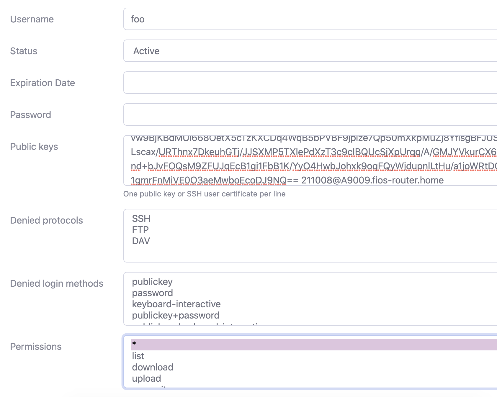

To test code related to SFTP servers locally, it is useful to spin up a local container that acts as SFTP server. [atmoz/sftp](https://github.com/atmoz/sftp) and [sftpgo](https://github.com/drakkan/sftpgo) are two such popular containerized solution options.


What follows below is a quick set of instructions to get you started using the `sftpgo` library. More detailed instructions can be found [here](https://github.com/drakkan/sftpgo/blob/main/docker/README.md). 


1. Generate a public/private key pair

   ```
   ssh-keygen -t rsa -b 4096 -f ssh_host_rsa_key < /dev/null
   ```

2. Launch an sftpgo container. Notice we are binding a local path on the host to the sftp server to simulate a file system.

   ```
   docker run --name some-sftpgo -p 127.0.0.1:8080:8080 -p 2022:2022 --mount type=bind,source=/Users/bajal/share,target=/outbox -d "drakkan/sftpgo:latest"
   ```

   

3. Go to [localhost:8080](http://localhost:8080/,) and setup a user.
   Copy the **public** key generated in step 1 here. Password could be left blank. 

   



4. Now you can connect to the server using the **private** key created in step 1 as: 

   ```
   sftp -v -P 2022 -i ssh_host_rsa_key foo@localhost
   ```

   

